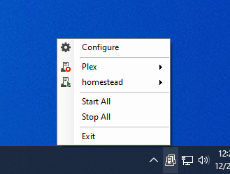
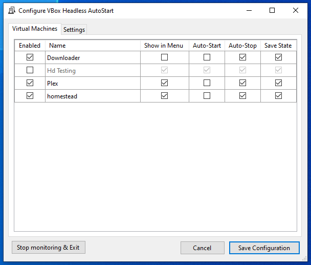

# VBox Headless AutoStart

This is an application to automatically start VirtualBox machines in headless mode when you log in to Windows and to
shut them down when you log out.

It currently only works with VirtualBox 6.0 and 6.1.

It has only been tested on Windows 10.

Icons from the [Visual Studio Image Library](https://www.google.com/search?q=site%3Amicrosoft.com+Visual+Studio+Image+Library)

 

## Similar Projects

 * [VBoxVmService](https://github.com/onlyfang/VBoxVmService/)
 * [VBoxHeadlessTray](https://github.com/toptensoftware/VBoxHeadlessTray)

## License

[MIT](https://opensource.org/licenses/MIT)
